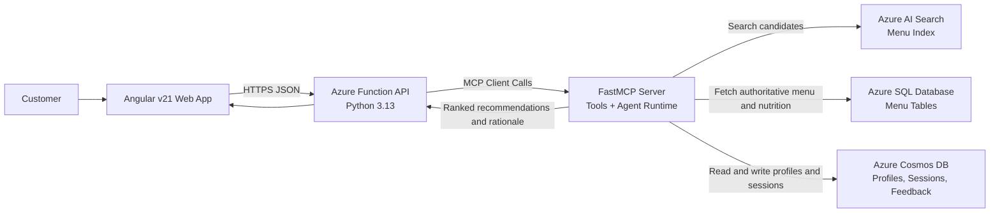

## Challenge: Build a Zava Resturant Meal-Recommendation AI Agent with MCP

### Goal

Our client Zava owns Zava Restaurant and needs a meal recommendation agent for their clients.

You have been hired to design and implement an AI agent in the form of a **web app** that recommends meals from a restaurant menu while respecting a customer’s **allergies**, **dietary restrictions**, and **preferences**. An **AI agent** (connected via **MCP**) will orchestrate search + data lookups and produce a ranked set of meal recommendations with explanations.

#### Expecations:
- I do not expect you to write all this code by yourself. I expect you to use GitHub Copilot, OpenAI Codex or Claude Code to implement it by telling it what to do.
- I expect to see a finalized requirements document as well as the architecture diagram first for us to discuss and set the expectations. The current architecture is a draft and has some problems we need to discuss and fix.
- Then once the requirements and architecture are finalized, then you can use the AI agents to create the app that works.

#### Tech stack:

* **Frontend:** Angular **v21**
* **Backend:** **Azure Functions** (Python **3.13**)
* **Data stores:** **Azure AI Search**, **Azure Cosmos DB**, **Azure SQL Database**
* **MCP server:** **FastMCP** Python SDK

---

## Phase 0 — Problem statement

### Problem statement

Restaurants often have large menus and customers may have allergies (e.g., peanuts), dietary restrictions (e.g., halal, vegan), and preferences (e.g., “spicy,” “high protein,” “no mushrooms”). Customers want fast, safe, and personalized suggestions.

Build an application that:

1. Collects customer constraints (allergies, restrictions, preferences). This should be stored in the customer profile.
2. Recommends meals from the menu that **avoid allergens**, **follow restrictions**, and **match preferences**.
3. Explains *why* each recommendation is suitable.
4. Logs interactions and allows the menu to be updated.

---

## Phase 1 — Requirements (what “done” looks like)

### Functional requirements

* Customer can enter:

  * Allergies (multiple)
  * Dietary restrictions (multiple)
  * Preferences (likes/dislikes + goals like “low carb” or “high protein”)
* App returns:

  * A ranked list of recommended meals (top N)
  * A brief explanation per meal (e.g., “no dairy, matches vegetarian, high protein”)
  * Safety flags when the menu data is uncertain (e.g., missing allergen info)
* Support these user flows:

  * “Recommend meals”
  * “Explain why this meal is safe”
  * “Show alternatives if nothing matches”
* Menu can be updated without redeploying the UI.

### Non-functional requirements

* Clear separation of concerns (UI, API, agent/MCP tools, data)
* Observability: basic logs + request IDs
* Basic security:

  * API protected (key or identity-based auth)
  * No sensitive customer info stored unless needed
* Performance:

  * Recommendations return quickly (target: a few seconds)
* Maintainability:

  * Simple structure, documented configuration, repeatable deployment

### Data responsibilities (simple mapping)

* **Azure SQL DB**: authoritative menu and nutrition facts (structured)
* **Cosmos DB**: customer preference profiles, session history, feedback (semi-structured)
* **Azure AI Search**: fast retrieval over menu descriptions, ingredients, allergen notes, tags (search + relevance)

---

## Phase 2 — Architecture (how it fits together)

### High-level architecture

* Angular app calls an Azure Function API.
* The Function calls an **MCP server** hosting tools the agent can use.
* The agent uses tools to:

  * Retrieve candidate meals from **Azure AI Search**
  * Fetch authoritative details from **Azure SQL**
  * Read/write user context and history in **Cosmos DB**
* The Function returns recommendations to the UI.

### Architecture diagram (conceptual)

---

## Phase 3 — Data model + indexing (keep it minimal)

### Menu data (SQL as source of truth)

Store each menu item with:

* Name, description
* Ingredients list (or ingredient references)
* Allergen markers (explicit fields where possible)
* Dietary tags (vegan, vegetarian, gluten-free, halal, kosher, etc.)
* Nutrition fields (optional, but useful for “high protein / low carb”)

### Search index (Azure AI Search)

Index fields used for retrieval:

* Name, description, ingredients text
* Allergen text + tags
* Dietary tags
* Cuisine, spice level, category
* “Hidden” signals for ranking (popularity, availability)

### Customer context (Cosmos DB)

Document per customer/session:

* Allergies, restrictions, likes/dislikes
* Past selections + feedback (“liked this”, “too spicy”)
* Agent outcomes (what was recommended and why)

---

## Phase 4 — MCP design (agent + tools)

### What the MCP server provides

Create a FastMCP server that exposes tools the agent can call. Keep the tool list small and focused:

1. **SearchMenuCandidates**

   * Input: constraints + free-text preferences
   * Output: list of candidate menu item IDs + brief snippets

2. **GetMenuItemDetails**

   * Input: menu item IDs
   * Output: authoritative details (ingredients, allergens, tags, nutrition)

3. **GetCustomerProfile**

   * Input: customer/session identifier
   * Output: saved preferences and history (Cosmos)

4. **SaveRecommendationOutcome**

   * Input: recommended items + customer feedback
   * Output: confirmation (Cosmos)

### Agent responsibilities (simple rules)

The agent should:

* Treat allergies as **hard blockers**.
* Treat dietary restrictions as **hard blockers** unless “flexible” is specified.
* Treat preferences as **soft ranking signals**.
* If the data is incomplete, return a “data missing” warning and offer safer options.

---

## Phase 5 — POC implementation (smallest working demo)

### POC scope

Deliver a working app that supports:

* One page in Angular:

  * Form for allergies, restrictions, preferences
  * Results list with explanations
* One Azure Function endpoint:

  * Accepts customer constraints
  * Calls MCP agent
  * Returns ranked results + rationale
* One MCP server:

  * Implements the tools above
  * Orchestrates retrieval + filtering + ranking
* Minimal data:

  * ~30 menu items with realistic ingredient/allergen/diet tags
  * A small set of customer profiles/sessions

### POC steps (simple checklist)

1. **Prepare data**

   * Populate Azure SQL with menu items + allergen/tag fields
   * Create/seed Cosmos DB with a couple of example profiles
   * Index menu in Azure AI Search

2. **Stand up MCP server**

   * Define the tools (search, details, profile, save outcome)
   * Ensure tools can access AI Search, SQL, and Cosmos

3. **Build Azure Function API**

   * One endpoint: “recommend meals”
   * Pass request context to the MCP agent
   * Return a clean response object for the UI

4. **Build Angular UI**

   * Simple form + validation (e.g., at least one constraint or preference)
   * Results list with:

     * Meal name
     * “Safe because…” explanation
     * “Avoid because…” if filtered out (optional for debug)

5. **Test key scenarios**

   * Peanut allergy + “likes spicy”
   * Gluten-free + “no dairy”
   * Vegan + “high protein”
   * No matches → safe fallback + suggestions (e.g., “remove one preference”)

---

## Phase 6 — Hardening (optional stretch goals)

### Reliability & quality

* Add consistent request IDs across UI → Function → MCP tools
* Add structured logs for:

  * constraints received
  * candidate count from search
  * filtered count after safety rules
  * final recommendations

### Safer recommendation behavior

* “Uncertain allergen data” flag if an item has missing allergen fields
* Require explicit confirmation before recommending uncertain items

### Product improvements

* Feedback loop: “thumbs up/down” stored in Cosmos
* Personalization: boost items similar to past liked meals
* Admin page for menu updates (still stored in SQL + indexed into AI Search)

---

### Future Updates to the AI Agent Capabilities

In the future, Zava Restaurant plans to add support for the following capabilities:

- Placing to-go orders
- Managing restaurant reservations as well.
- Retrieving previous restaurant reservations.
- communicating by voice only with the AI agent without having to type
- adding support for other modern languages like Spanish, French and Portugeese.

## Deliverables (what you should submit)

### Part 1: Project Requirements

I expect to see a requirements document the explains all the requirements and how the app needs to behave

### Part 2: Architecture Diagram

I expect to see an architecture diagram that describes all the archictural components and why they are relevant

### Part 3: POC Implementation

* A short README describing:
  * What the app does
  * How MCP is used (tools + agent flow)
  * Which datastore holds what
  * How to run the UI + Function + MCP server locally (high level)
* A single architecture diagram (like the one above explaining the architectural components and why they are relevant to the project)
* A demo script: outline how you are going to present the demo

